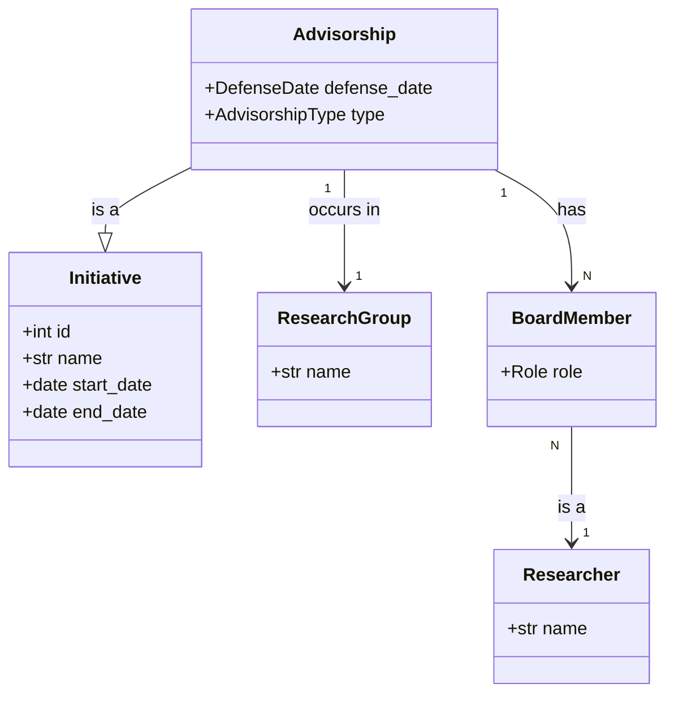

# Domain Model: Advisorship (Orientação)

## 1. Concept Definition

An **Advisorship** (Orientação) is a specialized type of **Initiative** that represents the academic guidance relationship between a **Supervisor** (Orientador) and a **Student** (Orientando).

As an **Initiative**, an Advisorship:
- Has a specific lifecycle (Start Date, End Date, Status).
- Is associated with a **Research Group** (Team) where the research takes place.
- Involves specific **Roles** (members of the bank/committee).

### 1.1 The "Banca" (Examination Board)
The user specifies that an Advisorship involves a "Banca" (Board). In this domain model, the **Advisorship itself** acts as the central context for the Board.
- The **Board** is a collection of Researchers (TeamMembers) associated with the Advisorship Initiative.
- **Roles** in an Advisorship:
    - **Supervisor** (Orientador): Leader of the initiative.
    - **Student** (Orientando): The primary focus of the advisorship.
    - **Board Member** (Membro da Banca): Internal or external researchers evaluating the work.

## 2. Entities & Value Objects

### 2.1 Advisorship (Entity)
Inherits from `Initiative`.
- **Attributes**:
    - `defense_date` (Date, optional): When the board convenes.
    - `type` (Enum): Master, Doctorate, Graduation, Scientific Initiation.
    - `status` (Enum): Active, Concluded, Cancelled.

### 2.2 BoardMember (Association / Value Object)
Represents a researcher's participation in the Advisorship.
- **Attributes**:
    - `researcher_id` (FK to Person/Researcher)
    - `advisorship_id` (FK to Advisorship)
    - `role` (Enum): Supervisor, Co-Supervisor, Internal Member, External Member.

## 3. Relationships

## 4. Business Rules

1.  **Composition**: An Advisorship MUST have at least one Supervisor and one Student.
2.  **Context**: An Advisorship MUST be linked to a Research Group.
3.  **Consistency**: All participants (Supervisor, Student, Board Members) MUST be registered as Researchers/Persons.
4.  **Board**: A standard Board (Banca) consists of the Supervisor and at least two other members (for Master/Doctorate).
