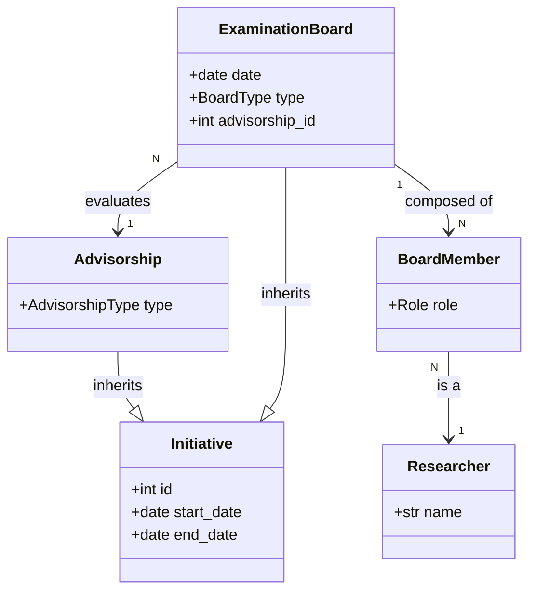

# Domain Model: Examination Board (Banca Examinadora)

## 1. Concept Definition

An **Examination Board** (Banca) is an **Initiative** representing the formal evaluation event of a Student's work (Thesis, Dissertation, etc.).

As per requirements:
- A Banca is an **Initiative**.
- It possesses a **Team**:
    - **Supervisor** (Orientador)
    - **Student** (Orientando)
    - **Board Members** (Membros da Banca)
- All participants are **Researchers**.

## 2. Relationships

The **Examination Board** is distinct from, but related to, the **Advisorship**.
- **Advisorship**: Long-running guidance relationship (Process).
- **Examination Board**: Specific evaluation event (Milestone).

## 3. Entities

### 3.1 ExaminationBoard (Entity)
Inherits from `Initiative`.
- **Attributes**:
    - `advisorship_id` (FK): Links to the parent Advisorship.
    - `date`: The date of the defense/exam (mapped from Initiative start_date or specific field).
    - `type`: Qualification (Qualificação) or Defense (Defesa).

### 3.2 BoardMember (Association)
Associates a Researcher to the Examination Board with a Role.
- **Attributes**:
    - `examination_board_id` (FK)
    - `researcher_id` (FK)
    - `role`: Supervisor, Co-Supervisor, Internal Examiner, External Examiner.

## 4. Use Cases
1.  **Schedule Board**: Create a new `ExaminationBoard` linked to an `Advisorship`.
2.  **Add Member**: Add a Researcher to the Board with a specific role.
3.  **Conclude Board**: Register the outcome (Approved/Rejected) - *handled via Initiative status*.
