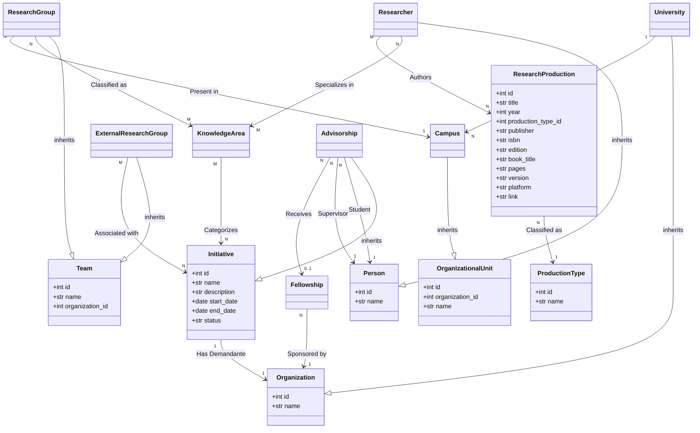

# Entities Overview: ResearchDomain

This document provides a comprehensive overview of the core entities in the ResearchDomain project, their relationships, and functional roles.

## 1. Class Model

The following diagram illustrates the associations, inheritance, and cardinality between the domain entities.

## 2. Entity Definitions

| Entity | Purpose | Key Attributes | Inheritance |
|:---|:---|:---|:---|
| **ResearchProduction** | Represents a book, software, or other research output. | `title`, `year`, `type`, `link` | - |
| **Researcher** | Represents an individual conducting research. | `cnpq_url`, `google_scholar_url`, `resume` | `Person` |
| **ResearchGroup** | A collective of researchers working on specific themes. | `campus_id`, `cnpq_url`, `site` | `Team` |
| **University** | The high-level academic organization. | `short_name` | `Organization` |
| **Campus** | A specific physical or administrative branch of a university. | `organization_id`, `short_name` | `OrganizationalUnit` |
| **Initiative** | A project, research effort, or development activity. | `name`, `start_date`, `end_date`, `status` | - |
| **Advisorship** | A specific initiative linking a student and a supervisor. | `student_id`, `supervisor_id`, `fellowship_id` | `Initiative` |
| **Fellowship** | A monetary grant (bolsa) given to a student. | `name`, `value`, `sponsor_id` | - |
| **KnowledgeArea** | A standard classification for fields of study. | `name` | - |
| **ExternalResearchGroup** | A research group from a partner institution. | `contact_email` | `Team` |
| **Organization** | Any legal entity (University, Sponsor, Demandante). | `name` | - |
| **Person** | Any individual participating in the system. | `name` | - |

## 3. Core Relationships

- **Hierarchical**: `University` contains `Campus`, which hosts `ResearchGroups`.
- **Academic**: `Researcher` and `ResearchGroup` are classified by multiple `KnowledgeAreas`.
- **Project-based**: `Initiative` is the core of collaborative work, which can be specialized as an `Advisorship`.
- **Funding**: `Advisorships` can be supported by `Fellowships`, which are provided by a sponsor `Organization`.
