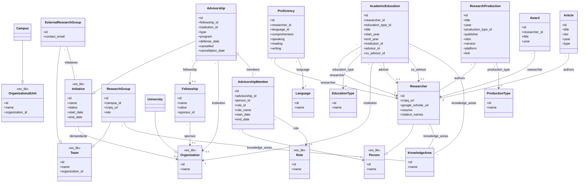

# Domain Layer Reference

This document describes the current code in [`src/research_domain/domain`](https://github.com/The-Band-Solution/ResearchDomain/tree/main/src/research_domain/domain).
It is intended for developers working on the domain model, SQLAlchemy mappings, and repository contracts of `research_domain`.

## Purpose of the `domain` package

The `domain` package concentrates the business model of the library:

- entity definitions mapped with SQLAlchemy
- association tables used by many-to-many and one-to-one links
- serialization helpers used by the application layer
- repository interfaces that define the persistence contracts expected by services and controllers

The package is built on top of two external libraries:

- `eo_lib`, which provides foundational entities such as `Person`, `Team`, `Organization`, `OrganizationalUnit`, `Initiative`, and `Role`
- `libbase`, which provides the generic repository contract used by repository interfaces

## Package structure

```text
src/research_domain/domain/
  __init__.py
  base.py
  mixins.py
  entities/
    academic_education.py
    advisorship.py
    article.py
    award.py
    external_research_group.py
    fellowship.py
    initiative_demandante.py
    knowledge_area.py
    language.py
    production_type.py
    proficiency.py
    research_group.py
    research_production.py
    researcher.py
    university.py
  repositories/
    repositories.py
```

## Design foundations

### SQLAlchemy base and inheritance

Most concrete models in this package are declared against `eo_lib.domain.base.Base` so they share metadata with inherited entities defined in `eo_lib`.
This is especially important for joined-table inheritance cases such as:

- `Researcher -> Person`
- `ResearchGroup -> Team`
- `ExternalResearchGroup -> Team`
- `Advisorship -> Initiative`
- `University -> Organization`
- `Campus -> OrganizationalUnit`

The local file [`base.py`](https://github.com/The-Band-Solution/ResearchDomain/blob/main/src/research_domain/domain/base.py) still defines a declarative base, but the entity modules currently map against the base imported from `eo_lib`.

### Serialization helper

[`mixins.py`](https://github.com/The-Band-Solution/ResearchDomain/blob/main/src/research_domain/domain/mixins.py) defines `SerializableMixin`.
Its `to_dict()` method walks the class MRO and collects mapped column attributes from the current entity and its inherited parents.
That behavior is useful for joined-table inheritance because a serialized object can include columns declared in parent tables.

## Class diagram

The diagram below emphasizes the concrete models declared in `research_domain.domain.entities` and the `eo_lib` base classes they extend.
For readability, only the most relevant local attributes are shown for each domain model.


```mermaid
classDiagram
    direction TB

    class Person {
        <<eo_lib>>
        +id
        +name
    }

    class Team {
        <<eo_lib>>
        +id
        +name
        +organization_id
    }

    class Organization {
        <<eo_lib>>
        +id
        +name
    }

    class OrganizationalUnit {
        <<eo_lib>>
        +id
        +name
        +organization_id
    }

    class Initiative {
        <<eo_lib>>
        +id
        +name
        +status
        +start_date
        +end_date
    }

    class Role {
        <<eo_lib>>
        +id
        +name
    }

    class Researcher {
        +id
        +cnpq_url
        +google_scholar_url
        +resume
        +citation_names
    }

    class ResearchGroup {
        +id
        +campus_id
        +cnpq_url
        +site
    }

    class ExternalResearchGroup {
        +id
        +contact_email
    }

    class University
    class Campus

    class KnowledgeArea {
        +id
        +name
    }

    class EducationType {
        +id
        +name
    }

    class AcademicEducation {
        +id
        +researcher_id
        +education_type_id
        +title
        +start_year
        +end_year
        +institution_id
        +advisor_id
        +co_advisor_id
    }

    class Language {
        +id
        +name
    }

    class Proficiency {
        +id
        +researcher_id
        +language_id
        +comprehension
        +speaking
        +reading
        +writing
    }

    class Award {
        +id
        +researcher_id
        +title
        +year
    }

    class Article {
        +id
        +title
        +doi
        +year
        +type
    }

    class Fellowship {
        +id
        +name
        +value
        +sponsor_id
    }

    class ProductionType {
        +id
        +name
    }

    class ResearchProduction {
        +id
        +title
        +year
        +production_type_id
        +publisher
        +isbn
        +version
        +platform
        +link
    }

    class AdvisorshipMember {
        +id
        +advisorship_id
        +person_id
        +role_id
        +role_name
        +start_date
        +end_date
    }

    class Advisorship {
        +id
        +fellowship_id
        +institution_id
        +type
        +program
        +defense_date
        +cancelled
        +cancellation_date
    }

    Researcher --|> Person
    ResearchGroup --|> Team
    ExternalResearchGroup --|> Team
    University --|> Organization
    Campus --|> OrganizationalUnit
    Advisorship --|> Initiative

    Researcher "*" -- "*" KnowledgeArea : knowledge_areas
    ResearchGroup "*" -- "*" KnowledgeArea : knowledge_areas
    AcademicEducation "*" --> "1" Researcher : researcher
    AcademicEducation "*" --> "1" EducationType : education_type
    AcademicEducation "*" --> "1" Organization : institution
    AcademicEducation "*" --> "0..1" Researcher : advisor
    AcademicEducation "*" --> "0..1" Researcher : co_advisor
    AcademicEducation "*" -- "*" KnowledgeArea : knowledge_areas
    Proficiency "*" --> "1" Researcher : researcher
    Proficiency "*" --> "1" Language : language
    Award "*" --> "1" Researcher : researcher
    Article "*" -- "*" Researcher : authors
    ResearchProduction "*" -- "*" Researcher : authors
    ResearchProduction "*" --> "1" ProductionType : production_type
    Fellowship "*" --> "0..1" Organization : sponsor
    Advisorship "*" --> "0..1" Fellowship : fellowship
    Advisorship "*" --> "0..1" Organization : institution
    Advisorship "1" o-- "*" AdvisorshipMember : members
    AdvisorshipMember "*" --> "1" Person : person
    AdvisorshipMember "*" --> "0..1" Role : role
    ExternalResearchGroup "*" -- "*" Initiative : initiatives
    Initiative "*" --> "0..1" Organization : demandante
```

## Attribute matrix

The table below lists the attributes declared locally in the domain models.
Inherited attributes from `eo_lib` base classes such as `Person.name`, `Team.description`, or `Initiative.status` are intentionally not repeated unless they are redefined locally in `research_domain`.

| Model | Base class | Table | Local attributes |
| :--- | :--- | :--- | :--- |
| `Researcher` | `Person` | `researchers` | `id`, `cnpq_url`, `google_scholar_url`, `resume`, `citation_names` |
| `ResearchGroup` | `Team` | `research_groups` | `id`, `campus_id`, `cnpq_url`, `site` |
| `ExternalResearchGroup` | `Team` | `external_research_groups` | `id`, `contact_email` |
| `University` | `Organization` | inherited from `eo_lib` | no local mapped columns |
| `Campus` | `OrganizationalUnit` | inherited from `eo_lib` | no local mapped columns |
| `KnowledgeArea` | `Base` | `knowledge_areas` | `id`, `name` |
| `EducationType` | `Base` | `education_types` | `id`, `name` |
| `AcademicEducation` | `Base` | `academic_educations` | `id`, `researcher_id`, `education_type_id`, `title`, `start_year`, `end_year`, `thesis_title`, `institution_id`, `advisor_id`, `co_advisor_id` |
| `Language` | `Base` | `languages` | `id`, `name` |
| `Proficiency` | `Base` | `proficiencies` | `id`, `researcher_id`, `language_id`, `comprehension`, `speaking`, `reading`, `writing` |
| `Award` | `Base` | `awards` | `id`, `researcher_id`, `title`, `year` |
| `Article` | `Base` | `articles` | `id`, `title`, `doi`, `year`, `type`, `journal_conference`, `volume`, `pages` |
| `Fellowship` | `Base` | `fellowships` | `id`, `name`, `description`, `value`, `sponsor_id` |
| `ProductionType` | `Base` | `production_types` | `id`, `name` |
| `ResearchProduction` | `Base` | `research_productions` | `id`, `title`, `year`, `production_type_id`, `publisher`, `isbn`, `edition`, `book_title`, `pages`, `version`, `platform`, `link` |
| `AdvisorshipMember` | `Base` | `advisorship_members` | `id`, `advisorship_id`, `person_id`, `role_id`, `role_name`, `start_date`, `end_date` |
| `Advisorship` | `Initiative` | `advisorships` | `id`, `fellowship_id`, `institution_id`, `type`, `program`, `defense_date`, `cancelled`, `cancellation_date` |

## Entity catalog

### `academic_education.py`

#### `EducationType`

Catalog entity for education levels such as graduation, master's, and doctorate.

Key fields:

- `id`
- `name`

#### `AcademicEducation`

Stores the academic history of a researcher.

Key fields:

- `id`
- `researcher_id`
- `education_type_id`
- `title`
- `start_year`
- `end_year`
- `thesis_title`
- `institution_id`
- `advisor_id`
- `co_advisor_id`

Relationships:

- `education_type -> EducationType`
- `researcher -> Researcher`
- `institution -> Organization`
- `advisor -> Researcher`
- `co_advisor -> Researcher`
- `knowledge_areas -> list[KnowledgeArea]`

Notes:

- Uses the association table `academic_education_knowledge_areas`.
- The constructor supports `knowledge_areas` through `kwargs` for in-memory/test scenarios.

### `advisorship.py`

#### `AdvisorshipType`

Enum representing the advisorship category:

- `SCIENTIFIC_INITIATION`
- `JUNIOR_SCIENTIFIC_INITIATION`
- `UNDERGRADUATE_THESIS`
- `MASTER_THESIS`
- `PHD_THESIS`
- `POST_DOCTORATE`

#### `AdvisorshipRole`

Enum representing the role of a participant in an advisorship:

- `STUDENT`
- `SUPERVISOR`
- `CO_SUPERVISOR`
- `BOARD_MEMBER`

#### `AdvisorshipMember`

Association entity between an advisorship and a participating person.

Key fields:

- `id`
- `advisorship_id`
- `person_id`
- `role_id`
- `role_name`
- `start_date`
- `end_date`

Relationships:

- `person -> Person`
- `role -> Role`
- `advisorship -> Advisorship`

#### `Advisorship`

Specialized initiative used to represent orientations, theses, dissertations, and related academic supervision.

Key fields:

- `id`
- `fellowship_id`
- `institution_id`
- `type`
- `program`
- `defense_date`
- `cancelled`
- `cancellation_date`

Relationships:

- `fellowship -> Fellowship`
- `institution -> Organization`
- `members -> list[AdvisorshipMember]`

Convenience properties and behavior:

- `student`: returns the member whose `role_name` is `Student`
- `supervisor`: returns the member whose `role_name` is `Supervisor`
- `board_members`: returns all members whose `role_name` is `Board Member`
- `is_volunteer`: returns `True` when no fellowship is linked
- `add_member(...)`: appends an `AdvisorshipMember` using a `Person` and a `Role`

### `article.py`

#### `ArticleType`

Enum for publication venue:

- `JOURNAL`
- `CONFERENCE_EVENT`

#### `Article`

Represents a scientific article with one or more authors.

Key fields:

- `id`
- `title`
- `doi`
- `year`
- `type`
- `journal_conference`
- `volume`
- `pages`

Relationships:

- `authors -> list[Researcher]`

Notes:

- Uses the association table `article_authors`.

### `award.py`

#### `Award`

Represents an award or distinction received by a researcher.

Key fields:

- `id`
- `researcher_id`
- `title`
- `year`

Relationships:

- `researcher -> Researcher`

### `external_research_group.py`

#### `ExternalResearchGroup`

Represents a research group from another institution participating in initiatives.

Base class:

- `Team` from `eo_lib`

Key fields:

- `id`
- `contact_email`

Relationships:

- `initiatives -> list[Initiative]`

Notes:

- Uses the association table `initiative_external_groups`.

### `fellowship.py`

#### `Fellowship`

Represents a scholarship or other funding source linked to an advisorship.

Key fields:

- `id`
- `name`
- `description`
- `value`
- `sponsor_id`

Relationships:

- `sponsor -> Organization`

### `initiative_demandante.py`

This module defines the `initiative_demandantes` association table and injects a runtime relationship into `Initiative`.

Relationship added at runtime:

- `Initiative.demandante -> Organization`

Design note:

- The relationship is configured with `uselist=False`, so the initiative side behaves like a scalar one-to-one reference.
- The organization side receives the back-reference `requested_initiatives`.

### `knowledge_area.py`

#### `KnowledgeArea`

Represents an area of knowledge used to classify initiatives and other academic records.

Key fields:

- `id`
- `name`

Relationships:

- `initiatives -> list[Initiative]`

Notes:

- Uses the association table `initiative_knowledge_areas`.

### `language.py`

#### `Language`

Catalog entity for supported languages.

Key fields:

- `id`
- `name`

### `production_type.py`

#### `ProductionType`

Catalog entity for research production categories such as books, chapters, or software.

Key fields:

- `id`
- `name`

### `proficiency.py`

#### `ProficiencyLevel`

Enum describing language skill levels:

- `BASICO`
- `MEDIO`
- `ALTO`
- `NAO_SE_APLICA`

#### `Proficiency`

Associates a researcher with a language and stores skill levels by dimension.

Key fields:

- `id`
- `researcher_id`
- `language_id`
- `comprehension`
- `speaking`
- `reading`
- `writing`

Relationships:

- `researcher -> Researcher`
- `language -> Language`

### `research_group.py`

#### `ResearchGroup`

Specialized `Team` representing an internal research group.

Key fields:

- `id`
- `campus_id`
- `cnpq_url`
- `site`

Relationships:

- `knowledge_areas -> list[KnowledgeArea]`

Notes:

- Uses the association table `group_knowledge_areas`.

### `research_production.py`

#### `ResearchProduction`

Represents research outputs beyond articles, including books, chapters, and software.

Key fields:

- `id`
- `title`
- `year`
- `production_type_id`
- `publisher`
- `isbn`
- `edition`
- `book_title`
- `pages`
- `version`
- `platform`
- `link`

Relationships:

- `production_type -> ProductionType`
- `authors -> list[Researcher]`

Notes:

- Uses the association table `production_authors`.
- The constructor accepts either `production_type_id` or a `production_type` object.

### `researcher.py`

#### `Researcher`

Specialized `Person` containing research-specific metadata and academic production links.

Key fields:

- `id`
- `cnpq_url`
- `google_scholar_url`
- `resume`
- `citation_names`

Relationships:

- `knowledge_areas -> list[KnowledgeArea]`
- `academic_educations -> list[AcademicEducation]`
- `proficiencies -> list[Proficiency]`
- `awards -> list[Award]`
- `articles -> list[Article]`
- `productions -> list[ResearchProduction]`

Notes:

- Uses the association table `researcher_knowledge_areas`.
- Configures cascade deletion on `academic_educations`, `proficiencies`, and `awards`.

### `university.py`

#### `University`

Type alias by inheritance over `Organization`.
No additional columns are introduced in this module.

#### `Campus`

Type alias by inheritance over `OrganizationalUnit`.
No additional columns are introduced in this module.

## Association tables and relationship helpers

The domain package declares the following explicit tables to support cross-entity relations:

| Table | Defined in | Purpose |
| :--- | :--- | :--- |
| `academic_education_knowledge_areas` | `academic_education.py` | Links `AcademicEducation` to `KnowledgeArea`. |
| `article_authors` | `article.py` | Links `Article` to `Researcher`. |
| `initiative_external_groups` | `external_research_group.py` | Links `ExternalResearchGroup` to `Initiative`. |
| `initiative_demandantes` | `initiative_demandante.py` | Links `Initiative` to its demandante `Organization`. |
| `initiative_knowledge_areas` | `knowledge_area.py` | Links `Initiative` to `KnowledgeArea`. |
| `group_knowledge_areas` | `research_group.py` | Links `ResearchGroup` to `KnowledgeArea`. |
| `production_authors` | `research_production.py` | Links `ResearchProduction` to `Researcher`. |
| `researcher_knowledge_areas` | `researcher.py` | Links `Researcher` to `KnowledgeArea`. |

## Repository contracts

[`repositories/repositories.py`](https://github.com/The-Band-Solution/ResearchDomain/blob/main/src/research_domain/domain/repositories/repositories.py) defines the persistence interfaces expected by the service layer.

### Interfaces inherited from `eo_lib`

- `ResearcherRepositoryInterface -> PersonRepositoryInterface`
- `UniversityRepositoryInterface -> OrganizationRepositoryInterface`
- `CampusRepositoryInterface -> OrganizationalUnitRepositoryInterface`
- `ResearchGroupRepositoryInterface -> TeamRepositoryInterface`

These keep the semantics of the generic entity types already modeled in `eo_lib`.

### Generic repository interfaces

The remaining contracts extend `libbase.infrastructure.interface.IRepository`:

- `KnowledgeAreaRepositoryInterface`
- `RoleRepositoryInterface`
- `AdvisorshipRepositoryInterface`
- `FellowshipRepositoryInterface`
- `AcademicEducationRepositoryInterface`
- `ArticleRepositoryInterface`
- `EducationTypeRepositoryInterface`
- `ProductionTypeRepositoryInterface`
- `ResearchProductionRepositoryInterface`

Additional specialized methods:

- `AcademicEducationRepositoryInterface.list_by_researcher(researcher_id)`
- `ArticleRepositoryInterface.list_by_year(year)`
- `ArticleRepositoryInterface.find_by_doi(doi)`

## Public exports

### `domain.entities`

[`src/research_domain/domain/entities/__init__.py`](https://github.com/The-Band-Solution/ResearchDomain/blob/main/src/research_domain/domain/entities/__init__.py) currently re-exports:

- `Researcher`
- `University`
- `Campus`
- `ResearchGroup`
- `KnowledgeArea`
- `ExternalResearchGroup`
- `initiative_demandantes`
- `Advisorship`
- `AdvisorshipRole`
- `AdvisorshipMember`
- `Fellowship`
- `ProductionType`
- `ResearchProduction`

### `domain.repositories`

[`src/research_domain/domain/repositories/__init__.py`](https://github.com/The-Band-Solution/ResearchDomain/blob/main/src/research_domain/domain/repositories/__init__.py) re-exports all repository contracts defined in `repositories.py`.

## Relationship summary

At a high level, the domain model organizes itself around five clusters:

- identity and structure: `Researcher`, `University`, `Campus`, `ResearchGroup`, `ExternalResearchGroup`
- classification catalogs: `KnowledgeArea`, `EducationType`, `ProductionType`, `Language`
- academic supervision: `Advisorship`, `AdvisorshipMember`, `Fellowship`
- academic trajectory: `AcademicEducation`, `Award`, `Proficiency`
- scientific output: `Article`, `ResearchProduction`

These clusters are tied together mainly by `Researcher`, `Initiative`, `Organization`, and `Team`, which are inherited from `eo_lib`.

## Maintenance guidance

When extending the domain layer:

- prefer adding new relationships in the entity module that owns the business concept
- keep constructor arguments compatible with both SQLAlchemy usage and in-memory tests
- use `SerializableMixin` only when column-based serialization is enough
- keep repository contracts in sync with new service behavior before implementing infrastructure adapters
- review this document whenever a field, enum, association table, or repository method changes
